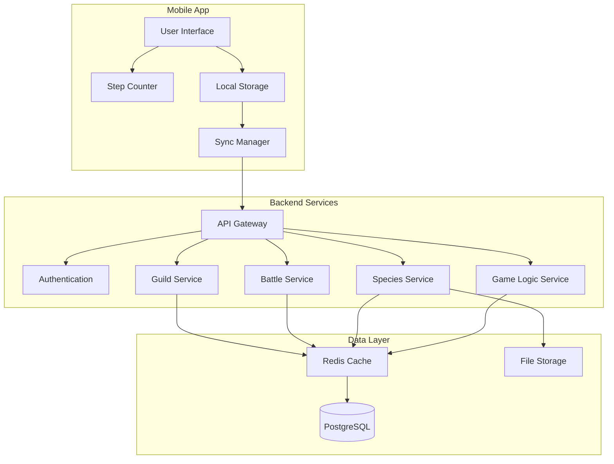
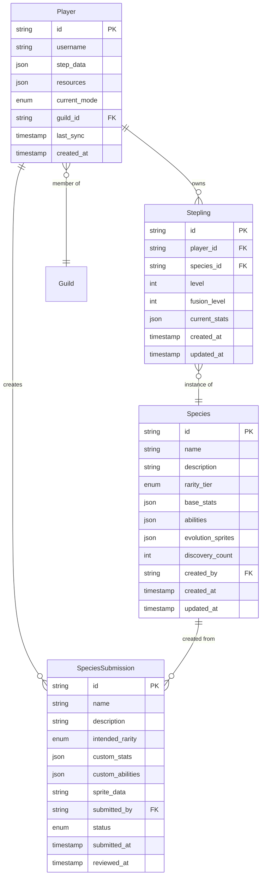

# Step Monsters Game - Design Document

## Overview

Step Monsters is a mobile MMO stepling collection game that transforms real-world walking into engaging gameplay. Players use device step counters to earn progression currency, discover unique stepling species, and build powerful collections through fusion mechanics. The game features a robust species identification system with community-driven content creation, balanced progression mechanics, and boss battle challenges.

### Core Game Loop
1. **Step Tracking**: Device pedometer tracks real-world steps
2. **Mode Selection**: Players choose Discovery Mode (cells) or Training Mode (XP)
3. **Stepling Discovery**: Cells convert to random stepling species via rarity algorithm
4. **Collection Building**: Train steplings with XP, fuse for evolution
5. **Boss Battles**: Test team composition against challenging encounters
6. **Community Engagement**: Create/select species designs, participate in guilds

## Architecture

### High-Level System Architecture



### Technology Stack

**Mobile Application:**
- React Native for cross-platform development
- Redux for state management
- AsyncStorage for local data persistence
- React Native Pedometer for step tracking

**Backend Services:**
- Node.js with Express.js framework
- PostgreSQL for primary data storage
- Redis for caching and session management
- AWS S3 for sprite/image storage
- JWT for authentication

**Infrastructure:**
- Docker containers for service deployment
- AWS ECS for container orchestration
- CloudFront CDN for asset delivery
- API Gateway for request routing

## Components and Interfaces

### Mobile Application Components

### Step Counter Integration
```typescript
interface StepCounterService {
  getCurrentSteps(): Promise<number>;
  getStepHistory(days: number): Promise<StepData[]>;
  startTracking(): void;
  stopTracking(): void;
}

// Integration with platform health APIs
const HEALTH_APIS = {
  ios: 'HealthKit',
  android: 'Google Fit / Samsung Health'
};

// Polling frequency: Every 30 seconds when app is active
// Sync frequency: Every 5 minutes or on app focus
// Hardware failure: Display error message directing user to enable health permissions
```

#### Game Mode Management
```typescript
interface GameModeService {
  getCurrentMode(): GameMode;
  switchMode(mode: GameMode): Promise<void>;
  convertStepsToResources(steps: number, mode: GameMode): Resources;
}

enum GameMode {
  DISCOVERY = 'discovery',
  TRAINING = 'training'
}

interface Resources {
  cells?: number;
  experiencePoints?: number;
}
```

### Species Discovery System
```typescript
interface DiscoveryService {
  inspectCell(magnifyingGlass?: MagnifyingGlass): Promise<Stepling>;
  getDiscoveryProbabilities(): Promise<RarityProbabilities>;
}

// Species database structure
interface Species {
  id: string;
  name: string;
  description: string;
  rarityTier: RarityTier;
  baseStats: SteplingStats;
  abilities: Ability[];
  evolutionSprites: string[];
  discoveryCount: number;
  isDiscovered: boolean; // New species start as false
  createdBy?: string;
}

// Discovery algorithm with undiscovered species handling
class DiscoveryAlgorithm {
  async generateSpecies(magnifyingGlass?: MagnifyingGlass): Promise<Species> {
    let currentTier = RarityTier.COMMON;
    
    // Roll for tier advancement
    while (true) {
      const roll = Math.random() * 100 + 1;
      const advanceThreshold = this.getAdvanceThreshold(magnifyingGlass, currentTier);
      
      if (roll <= advanceThreshold) {
        currentTier = this.getNextTier(currentTier);
        if (!this.getNextTier(currentTier)) break; // Max tier reached
      } else {
        break;
      }
    }
    
    // Get species from tier, prioritizing undiscovered
    return this.selectSpeciesFromTier(currentTier);
  }
  
  private async selectSpeciesFromTier(tier: RarityTier): Promise<Species> {
    const allSpecies = await this.getSpeciesByTier(tier);
    const undiscovered = allSpecies.filter(s => !s.isDiscovered);
    
    if (undiscovered.length > 0) {
      // Always prioritize undiscovered species
      return this.weightedRandomSelect(undiscovered);
    } else {
      // Use dynamic balancing for discovered species
      return this.balancedRandomSelect(allSpecies);
    }
  }
}
```

### Backend Service Interfaces

#### Species Management Service
```typescript
interface SpeciesService {
  getSpeciesByTier(tier: RarityTier): Promise<Species[]>;
  createCustomSpecies(submission: SpeciesSubmission): Promise<string>;
  approveSpeciesSubmission(submissionId: string): Promise<void>;
  updateDiscoveryBalancing(): Promise<void>;
}

interface Species {
  id: string;
  name: string;
  description: string;
  rarityTier: RarityTier;
  baseStats: MonsterStats;
  abilities: Ability[];
  evolutionSprites: string[];
  discoveryCount: number;
  createdBy?: string;
}

interface SpeciesSubmission {
  name: string;
  description: string;
  intendedRarity: RarityTier;
  customStats: SteplingStats;
  customAbilities: Ability[];
  spriteData: string;
  submittedBy: string;
}
```

#### Discovery Algorithm Service
```typescript
interface DiscoveryAlgorithm {
  generateSpecies(magnifyingGlass?: MagnifyingGlass): Promise<Species>;
  calculateRarityAdvancement(roll: number, magnifyingGlass?: MagnifyingGlass): RarityTier;
  getSpeciesFromTier(tier: RarityTier): Promise<Species>;
}

interface MagnifyingGlass {
  tier: RarityTier;
  advancementRange: [number, number]; // e.g., [96, 100] for rare glass
}
```

#### Battle System Service
```typescript
interface BattleService {
  getBossEncounters(): Promise<BossEncounter[]>;
  initiateBattle(playerId: string, bossId: string, team: Stepling[]): Promise<BattleResult>;
  calculateTeamPositioning(team: Stepling[]): Stepling[];
}

interface BossEncounter {
  id: string;
  name: string;
  difficulty: number;
  requiredStats: SteplingStats;
  rewards: BattleReward[];
}

interface BattleResult {
  victory: boolean;
  rewards: BattleReward[];
  teamPerformance: TeamPerformance;
}
```

## Data Models

### Core Entity Relationships



### Database Schema Design

#### Species Table
```sql
CREATE TABLE species (
    id UUID PRIMARY KEY DEFAULT gen_random_uuid(),
    name VARCHAR(100) NOT NULL,
    description TEXT,
    rarity_tier VARCHAR(20) NOT NULL CHECK (rarity_tier IN ('common', 'uncommon', 'rare', 'epic', 'legendary')),
    base_stats JSONB NOT NULL,
    abilities JSONB NOT NULL DEFAULT '[]',
    evolution_sprites JSONB NOT NULL DEFAULT '[]',
    discovery_count INTEGER DEFAULT 0,
    max_fusion_level INTEGER DEFAULT 2,
    created_by UUID REFERENCES players(id),
    created_at TIMESTAMP DEFAULT NOW(),
    updated_at TIMESTAMP DEFAULT NOW()
);

CREATE INDEX idx_species_rarity ON species(rarity_tier);
CREATE INDEX idx_species_discovery_count ON species(discovery_count);
```

#### Discovery Balancing Cache
```sql
CREATE TABLE discovery_probabilities (
    rarity_tier VARCHAR(20) PRIMARY KEY,
    base_probability DECIMAL(10,8) NOT NULL,
    species_weights JSONB NOT NULL,
    last_updated TIMESTAMP DEFAULT NOW()
);
```

### Stat Validation Rules

#### Rarity Tier Limits
```typescript
const RARITY_LIMITS = {
  common: {
    baseStats: 100,
    maxAbilities: 2,
    fusionMultiplier: 0.1,
    maxEvolutionBonus: 10
  },
  uncommon: {
    baseStats: 1000,
    maxAbilities: 3,
    fusionMultiplier: 0.15,
    maxEvolutionBonus: 100
  },
  rare: {
    baseStats: 10000,
    maxAbilities: 4,
    fusionMultiplier: 0.2,
    maxEvolutionBonus: 1000
  },
  epic: {
    baseStats: 100000,
    maxAbilities: 5,
    fusionMultiplier: 0.25,
    maxEvolutionBonus: 10000
  },
  legendary: {
    baseStats: 1000000,
    maxAbilities: 6,
    fusionMultiplier: 0.3,
    maxEvolutionBonus: 100000
  }
};
```

#### Power Calculation Formula
```typescript
function calculateSteplingPower(stepling: Stepling): number {
  const basePower = stepling.species.baseStats;
  const fusionBonus = 1 + (stepling.fusionLevel * stepling.species.fusionMultiplier);
  const levelMultiplier = 1 + (stepling.level * 0.05); // 5% per level
  
  return basePower * fusionBonus * levelMultiplier;
}
```

This ensures that rarity hierarchy is always maintained - a rare stepling will always significantly outpower a common stepling regardless of fusion investment, preserving the 100x discovery rarity in final power scaling.

## Error Handling

### Client-Side Error Management
- **Network Failures**: Queue operations for retry when connection restored
- **Step Counter Unavailable**: Graceful degradation with manual input option
- **Sync Conflicts**: Last-write-wins with conflict notification
- **Invalid Species Data**: Fallback to default species templates

### Server-Side Error Handling
- **Database Failures**: Circuit breaker pattern with Redis fallback
- **Species Validation Errors**: Detailed error messages for submission fixes
- **Rate Limiting**: Exponential backoff for API requests
- **Discovery Algorithm Failures**: Fallback to basic random selection

### Error Response Format
```typescript
interface ErrorResponse {
  error: {
    code: string;
    message: string;
    details?: any;
    retryable: boolean;
  };
  timestamp: string;
  requestId: string;
}
```

## Testing Strategy

### Unit Testing
- **Species Discovery Algorithm**: Test rarity advancement logic with various magnifying glass configurations
- **Stat Validation**: Verify tier limits and custom species validation rules
- **Fusion Mechanics**: Test level caps and stat calculations
- **Step Counter Integration**: Mock pedometer data for consistent testing

### Integration Testing
- **API Endpoints**: Test complete request/response cycles for all services
- **Database Operations**: Verify data consistency across species creation and discovery
- **Sync Mechanisms**: Test offline/online data synchronization scenarios
- **Community Submissions**: End-to-end testing of species creation workflow

### Performance Testing
- **Discovery Algorithm**: Load test with concurrent species generation requests
- **Database Queries**: Optimize species lookup and balancing calculations
- **Mobile App**: Memory usage testing with large stepling collections
- **Caching Strategy**: Verify Redis performance under high load

### Security Testing
- **Authentication**: JWT token validation and refresh mechanisms
- **Input Validation**: SQL injection and XSS prevention for species submissions
- **Rate Limiting**: Prevent abuse of discovery and submission endpoints
- **Data Privacy**: Ensure step data encryption and secure transmission

## Performance Considerations

### Caching Strategy
- **Species Data**: Cache frequently accessed species in Redis (TTL: 1 hour)
- **Discovery Probabilities**: Cache probability tables (TTL: 24 hours)
- **Player Collections**: Cache active player data (TTL: 30 minutes)
- **Battle Results**: Cache boss encounter data (TTL: 6 hours)

### Database Optimization
- **Indexing**: Composite indexes on species(rarity_tier, discovery_count)
- **Partitioning**: Partition monster table by player_id for large collections
- **Read Replicas**: Separate read/write operations for species discovery
- **Connection Pooling**: Optimize database connection management

### Mobile App Performance
- **Lazy Loading**: Load stepling sprites on-demand
- **Background Sync**: Sync step data during app idle periods
- **Memory Management**: Implement collection virtualization for large lists
- **Battery Optimization**: Efficient step counter polling intervals

## Security Measures

### Authentication & Authorization
- **JWT Tokens**: Short-lived access tokens with refresh token rotation
- **Role-Based Access**: Admin roles for species approval workflows
- **Device Binding**: Prevent account sharing through device fingerprinting
- **Rate Limiting**: Per-user limits on API requests and submissions

### Data Protection
- **Encryption**: AES-256 encryption for sensitive player data
- **Input Sanitization**: Comprehensive validation for all user inputs
- **SQL Injection Prevention**: Parameterized queries and ORM usage
- **XSS Protection**: Content Security Policy and input encoding

### Anti-Cheat Measures
- **Step Validation**: Server-side validation of step count increases
- **Sync Window Limits**: 7-day maximum offline accumulation
- **Anomaly Detection**: Flag suspicious step count patterns
- **Device Verification**: Validate step counter hardware availability
#
## Community Submission Workflow

#### Submission Process
```typescript
interface CommunitySubmissionWorkflow {
  submitSpecies(submission: SpeciesSubmission): Promise<string>;
  reviewSubmission(submissionId: string, decision: ReviewDecision): Promise<void>;
  getSubmissionStatus(submissionId: string): Promise<SubmissionStatus>;
}

interface SpeciesSubmission {
  name: string; // Max 50 characters, alphanumeric + spaces
  description: string; // Max 500 characters
  intendedRarity: RarityTier;
  customStats: SteplingStats; // Must comply with tier limits
  customAbilities: Ability[]; // Max abilities per tier
  spriteData: string; // Base64 encoded PNG, max 1MB
  submittedBy: string;
  submissionDate: Date;
}

enum SubmissionStatus {
  PENDING = 'pending',
  APPROVED = 'approved',
  REJECTED = 'rejected',
  IN_REVIEW = 'in_review'
}

interface ReviewDecision {
  approved: boolean;
  feedback?: string; // Required if rejected
  moderatorId: string;
  reviewDate: Date;
}
```

#### Admin Review Interface
```typescript
interface AdminReviewSystem {
  getPendingSubmissions(): Promise<SpeciesSubmission[]>;
  validateSubmission(submission: SpeciesSubmission): ValidationResult;
  approveSubmission(submissionId: string, feedback?: string): Promise<void>;
  rejectSubmission(submissionId: string, reason: string): Promise<void>;
}

interface ValidationResult {
  isValid: boolean;
  errors: ValidationError[];
  warnings: ValidationWarning[];
}

// Automatic validation rules
const VALIDATION_RULES = {
  name: {
    minLength: 3,
    maxLength: 50,
    allowedChars: /^[a-zA-Z0-9\s]+$/,
    bannedWords: ['admin', 'test', 'pokemon'] // Configurable list
  },
  description: {
    minLength: 10,
    maxLength: 500,
    profanityFilter: true
  },
  sprite: {
    maxSize: 1048576, // 1MB
    allowedFormats: ['PNG'],
    minDimensions: [64, 64],
    maxDimensions: [512, 512]
  },
  stats: {
    mustMatchTierLimits: true,
    totalStatsRange: 'per tier configuration'
  }
};
```

#### Approval Workflow
1. **Automatic Validation**: Check name, description, sprite format, stat limits
2. **Queue Assignment**: Add to admin review queue with priority based on submission date
3. **Manual Review**: Admin checks for appropriateness, balance, quality
4. **Decision Recording**: Approve with optional feedback or reject with required reason
5. **User Notification**: Email/in-app notification of decision
6. **Database Integration**: Approved species added to discovery pool with `isDiscovered: false`

### Battle System Mechanics

#### Team Positioning Algorithm
```typescript
interface BattlePositioning {
  calculateFormation(team: Stepling[]): BattleFormation;
  getPositionBonus(position: BattlePosition): StatBonus;
}

interface BattleFormation {
  frontRow: Stepling[]; // Highest defense stats
  middleRow: Stepling[]; // Balanced stats
  backRow: Stepling[]; // Highest attack/special stats
}

class PositioningAlgorithm {
  calculateFormation(team: Stepling[]): BattleFormation {
    // Sort by composite defensive score
    const sortedByDefense = team.sort((a, b) => {
      const aDefense = a.stats.defense + (a.stats.health * 0.5);
      const bDefense = b.stats.defense + (b.stats.health * 0.5);
      return bDefense - aDefense;
    });
    
    return {
      frontRow: sortedByDefense.slice(0, 2), // Top 2 defenders
      middleRow: sortedByDefense.slice(2, 4), // Middle 2
      backRow: sortedByDefense.slice(4, 6)    // Remaining attackers
    };
  }
}

// Position bonuses
const POSITION_BONUSES = {
  frontRow: { defense: 1.2, health: 1.15 }, // 20% defense, 15% health
  middleRow: { attack: 1.1, defense: 1.05 }, // 10% attack, 5% defense
  backRow: { attack: 1.25, special: 1.2 }    // 25% attack, 20% special
};
```

#### Boss Encounter System
```typescript
interface BossEncounter {
  id: string;
  name: string;
  difficulty: number; // 1-10 scale
  requiredPower: number; // Minimum team power recommendation
  mechanics: BossMechanic[]; // Special abilities/phases
  rewards: BattleReward[];
  unlockRequirements: UnlockRequirement[];
}

interface BossMechanic {
  name: string;
  description: string;
  triggerCondition: string; // "health < 50%", "turn 5", etc.
  effect: MechanicEffect;
}

// Boss scaling formula
function calculateBossStats(baseBoss: BossTemplate, playerLevel: number): BossStats {
  const scalingFactor = 1 + (playerLevel * 0.1); // 10% per player level
  return {
    health: baseBoss.baseHealth * scalingFactor,
    attack: baseBoss.baseAttack * scalingFactor,
    defense: baseBoss.baseDefense * scalingFactor,
    special: baseBoss.baseSpecial * scalingFactor
  };
}
```

### Guild System Specifications

#### Guild Management
```typescript
interface GuildSystem {
  createGuild(name: string, description: string, creatorId: string): Promise<Guild>;
  joinGuild(guildId: string, playerId: string): Promise<void>;
  leaveGuild(guildId: string, playerId: string): Promise<void>;
  promotePlayer(guildId: string, playerId: string, role: GuildRole): Promise<void>;
}

interface Guild {
  id: string;
  name: string; // Max 30 characters, unique
  description: string; // Max 200 characters
  memberCount: number;
  maxMembers: number; // Fixed at 20
  createdDate: Date;
  level: number; // Based on collective member activity
  members: GuildMember[];
}

interface GuildMember {
  playerId: string;
  role: GuildRole;
  joinDate: Date;
  contributionScore: number; // Based on activity
}

enum GuildRole {
  LEADER = 'leader',     // 1 per guild, can promote/kick anyone
  OFFICER = 'officer',   // Up to 3, can kick members, organize tournaments
  MEMBER = 'member'      // Standard members
}
```

#### Tournament System
```typescript
interface TournamentSystem {
  createTournament(guildId: string, config: TournamentConfig): Promise<Tournament>;
  joinTournament(tournamentId: string, playerId: string, team: Stepling[]): Promise<void>;
  processTournamentRound(tournamentId: string): Promise<TournamentResults>;
}

interface TournamentConfig {
  name: string;
  type: TournamentType; // SINGLE_ELIMINATION, ROUND_ROBIN
  maxParticipants: number; // Max 16 for single elimination
  entryRequirement: EntryRequirement;
  rewards: TournamentReward[];
  startDate: Date;
  registrationDeadline: Date;
}

enum TournamentType {
  SINGLE_ELIMINATION = 'single_elimination', // 8 or 16 players
  ROUND_ROBIN = 'round_robin',              // Up to 8 players
  GUILD_WAR = 'guild_war'                   // Guild vs Guild
}

// Tournament bracket generation
class BracketGenerator {
  generateSingleElimination(participants: Player[]): TournamentBracket {
    const shuffled = this.shuffleArray(participants);
    const rounds = Math.ceil(Math.log2(shuffled.length));
    
    return {
      rounds: rounds,
      matches: this.createMatches(shuffled),
      currentRound: 1
    };
  }
}
```

### Data Synchronization Specifications

#### Sync Conflict Resolution
```typescript
interface SyncManager {
  syncPlayerData(playerId: string): Promise<SyncResult>;
  resolveConflict(conflict: DataConflict): Promise<ConflictResolution>;
  rollbackTransaction(transactionId: string): Promise<void>;
}

interface DataConflict {
  field: string; // 'stepCount', 'steplingCollection', etc.
  localValue: any;
  serverValue: any;
  lastSyncTimestamp: Date;
  conflictTimestamp: Date;
}

enum ConflictResolutionStrategy {
  SERVER_WINS = 'server_wins',     // Default for most data
  CLIENT_WINS = 'client_wins',     // For step counts within 7-day window
  MERGE_VALUES = 'merge_values',   // For collections (union of steplings)
  MANUAL_REVIEW = 'manual_review'  // For suspicious conflicts
}

// Sync triggers
const SYNC_TRIGGERS = {
  appForeground: true,        // When app comes to foreground
  stepCountChange: true,      // When significant step increase detected
  modeSwitch: true,          // When switching discovery/training modes
  cellInspection: true,      // Before and after cell inspection
  battleComplete: true,      // After boss battles
  periodicInterval: 300000   // Every 5 minutes when active
};

// Rollback procedures
interface RollbackProcedure {
  validateRollback(transactionId: string): Promise<boolean>;
  createBackup(playerId: string): Promise<string>;
  restoreFromBackup(backupId: string): Promise<void>;
  notifyPlayer(playerId: string, reason: string): Promise<void>;
}
```

#### Offline Data Handling
```typescript
interface OfflineDataManager {
  queueOperation(operation: OfflineOperation): void;
  processQueue(): Promise<QueueResult[]>;
  validateOfflineData(data: OfflinePlayerData): ValidationResult;
}

interface OfflineOperation {
  type: OperationType; // 'step_update', 'mode_switch', 'cell_inspect'
  data: any;
  timestamp: Date;
  playerId: string;
}

// 7-day offline limit enforcement
const OFFLINE_LIMITS = {
  maxDays: 7,
  maxStepsPerDay: 50000,      // Reasonable daily maximum
  suspiciousThreshold: 30000,  // Flag for review
  rollbackThreshold: 100000    // Auto-rollback if exceeded
};
```