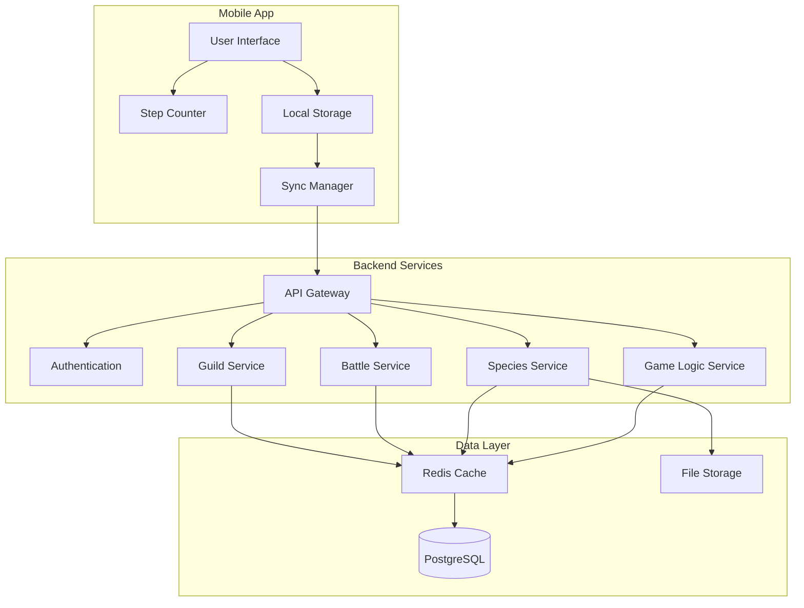
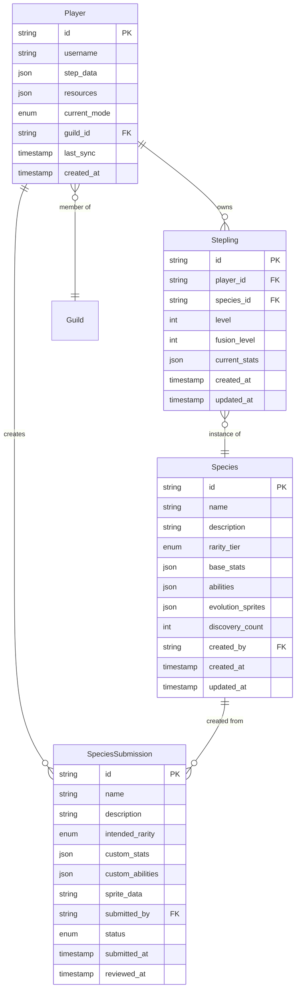

# Step Monsters Game - Design Document

## Overview

Step Monsters is a mobile MMO stepling collection game that transforms real-world walking into engaging gameplay. Players use device step counters to earn progression currency, discover unique stepling species, and build powerful collections through fusion mechanics. The game features a robust species identification system with community-driven content creation, balanced progression mechanics, and boss battle challenges.

### Core Game Loop
1. **Step Tracking**: Device pedometer tracks real-world steps
2. **Mode Selection**: Players choose Discovery Mode (cells) or Training Mode (XP)
3. **Stepling Discovery**: Cells convert to random stepling species via rarity algorithm
4. **Collection Building**: Train steplings with XP, fuse for evolution
5. **Boss Battles**: Test team composition against challenging encounters
6. **Community Engagement**: Create/select species designs, participate in guilds

## Architecture

### High-Level System Architecture



### Technology Stack

**Mobile Application:**
- React Native for cross-platform development
- Redux for state management
- AsyncStorage for local data persistence
- React Native Pedometer for step tracking

**Backend Services:**
- Node.js with Express.js framework
- PostgreSQL for primary data storage
- Redis for caching and session management
- AWS S3 for sprite/image storage
- JWT for authentication

**Infrastructure:**
- Docker containers for service deployment
- AWS ECS for container orchestration
- CloudFront CDN for asset delivery
- API Gateway for request routing

## Components and Interfaces

### Mobile Application Components

### Step Counter Integration
```typescript
interface StepCounterService {
  getCurrentSteps(): Promise<number>;
  getStepHistory(days: number): Promise<StepData[]>;
  startTracking(): void;
  stopTracking(): void;
}

// Integration with platform health APIs
const HEALTH_APIS = {
  ios: 'HealthKit',
  android: 'Google Fit / Samsung Health'
};

// Polling frequency: Every 30 seconds when app is active
// Sync frequency: Every 5 minutes or on app focus
// Hardware failure: Display error message directing user to enable health permissions
```

#### Game Mode Management
```typescript
interface GameModeService {
  getCurrentMode(): GameMode;
  switchMode(mode: GameMode): Promise<void>;
  convertStepsToResources(steps: number, mode: GameMode): Resources;
}

enum GameMode {
  DISCOVERY = 'discovery',
  TRAINING = 'training'
}

interface Resources {
  cells?: number;
  experiencePoints?: number;
}
```

### Species Discovery System
```typescript
interface DiscoveryService {
  inspectCell(magnifyingGlass?: MagnifyingGlass): Promise<Stepling>;
  getDiscoveryProbabilities(): Promise<RarityProbabilities>;
}

// Species database structure
interface Species {
  id: string;
  name: string;
  description: string;
  rarityTier: RarityTier;
  baseStats: SteplingStats;
  abilities: Ability[];
  evolutionSprites: string[];
  discoveryCount: number;
  isDiscovered: boolean; // New species start as false
  createdBy?: string;
}

// Discovery algorithm with undiscovered species handling
class DiscoveryAlgorithm {
  async generateSpecies(magnifyingGlass?: MagnifyingGlass): Promise<Species> {
    let currentTier = RarityTier.COMMON;
    
    // Roll for tier advancement
    while (true) {
      const roll = Math.random() * 100 + 1;
      const advanceThreshold = this.getAdvanceThreshold(magnifyingGlass, currentTier);
      
      if (roll <= advanceThreshold) {
        currentTier = this.getNextTier(currentTier);
        if (!this.getNextTier(currentTier)) break; // Max tier reached
      } else {
        break;
      }
    }
    
    // Get species from tier, prioritizing undiscovered
    return this.selectSpeciesFromTier(currentTier);
  }
  
  private async selectSpeciesFromTier(tier: RarityTier): Promise<Species> {
    const allSpecies = await this.getSpeciesByTier(tier);
    const undiscovered = allSpecies.filter(s => !s.isDiscovered);
    
    if (undiscovered.length > 0) {
      // Always prioritize undiscovered species
      return this.weightedRandomSelect(undiscovered);
    } else {
      // Use dynamic balancing for discovered species
      return this.balancedRandomSelect(allSpecies);
    }
  }
}
```

### Backend Service Interfaces

#### Species Management Service
```typescript
interface SpeciesService {
  getSpeciesByTier(tier: RarityTier): Promise<Species[]>;
  createCustomSpecies(submission: SpeciesSubmission): Promise<string>;
  approveSpeciesSubmission(submissionId: string): Promise<void>;
  updateDiscoveryBalancing(): Promise<void>;
}

interface Species {
  id: string;
  name: string;
  description: string;
  rarityTier: RarityTier;
  baseStats: MonsterStats;
  abilities: Ability[];
  evolutionSprites: string[];
  discoveryCount: number;
  createdBy?: string;
}

interface SpeciesSubmission {
  name: string;
  description: string;
  intendedRarity: RarityTier;
  customStats: SteplingStats;
  customAbilities: Ability[];
  spriteData: string;
  submittedBy: string;
}
```

#### Discovery Algorithm Service
```typescript
interface DiscoveryAlgorithm {
  generateSpecies(magnifyingGlass?: MagnifyingGlass): Promise<Species>;
  calculateRarityAdvancement(roll: number, magnifyingGlass?: MagnifyingGlass): RarityTier;
  getSpeciesFromTier(tier: RarityTier): Promise<Species>;
}

interface MagnifyingGlass {
  tier: RarityTier;
  advancementRange: [number, number]; // e.g., [96, 100] for rare glass
}
```

#### Battle System Service
```typescript
interface BattleService {
  getBossEncounters(): Promise<BossEncounter[]>;
  initiateBattle(playerId: string, bossId: string, team: Stepling[]): Promise<BattleResult>;
  calculateTeamPositioning(team: Stepling[]): Stepling[];
}

interface BossEncounter {
  id: string;
  name: string;
  difficulty: number;
  requiredStats: SteplingStats;
  rewards: BattleReward[];
}

interface BattleResult {
  victory: boolean;
  rewards: BattleReward[];
  teamPerformance: TeamPerformance;
}
```

## Data Models

### Core Entity Relationships



### Database Schema Design

#### Species Table
```sql
CREATE TABLE species (
    id UUID PRIMARY KEY DEFAULT gen_random_uuid(),
    name VARCHAR(100) NOT NULL,
    description TEXT,
    rarity_tier VARCHAR(20) NOT NULL CHECK (rarity_tier IN ('common', 'uncommon', 'rare', 'epic', 'legendary')),
    base_stats JSONB NOT NULL,
    abilities JSONB NOT NULL DEFAULT '[]',
    evolution_sprites JSONB NOT NULL DEFAULT '[]',
    discovery_count INTEGER DEFAULT 0,
    max_fusion_level INTEGER DEFAULT 2,
    created_by UUID REFERENCES players(id),
    created_at TIMESTAMP DEFAULT NOW(),
    updated_at TIMESTAMP DEFAULT NOW()
);

CREATE INDEX idx_species_rarity ON species(rarity_tier);
CREATE INDEX idx_species_discovery_count ON species(discovery_count);
```

#### Discovery Balancing Cache
```sql
CREATE TABLE discovery_probabilities (
    rarity_tier VARCHAR(20) PRIMARY KEY,
    base_probability DECIMAL(10,8) NOT NULL,
    species_weights JSONB NOT NULL,
    last_updated TIMESTAMP DEFAULT NOW()
);
```

### Stat Validation Rules

#### Rarity Tier Limits
```typescript
const RARITY_LIMITS = {
  common: {
    baseStats: 100,
    maxAbilities: 2,
    fusionMultiplier: 0.1,
    maxEvolutionBonus: 10
  },
  uncommon: {
    baseStats: 1000,
    maxAbilities: 3,
    fusionMultiplier: 0.15,
    maxEvolutionBonus: 100
  },
  rare: {
    baseStats: 10000,
    maxAbilities: 4,
    fusionMultiplier: 0.2,
    maxEvolutionBonus: 1000
  },
  epic: {
    baseStats: 100000,
    maxAbilities: 5,
    fusionMultiplier: 0.25,
    maxEvolutionBonus: 10000
  },
  legendary: {
    baseStats: 1000000,
    maxAbilities: 6,
    fusionMultiplier: 0.3,
    maxEvolutionBonus: 100000
  }
};
```

#### Power Calculation Formula
```typescript
function calculateSteplingPower(stepling: Stepling): number {
  const basePower = stepling.species.baseStats;
  const fusionBonus = 1 + (stepling.fusionLevel * stepling.species.fusionMultiplier);
  const levelMultiplier = 1 + (stepling.level * 0.05); // 5% per level
  
  return basePower * fusionBonus * levelMultiplier;
}
```

This ensures that rarity hierarchy is always maintained - a rare stepling will always significantly outpower a common stepling regardless of fusion investment, preserving the 100x discovery rarity in final power scaling.

## Error Handling

### Client-Side Error Management
- **Network Failures**: Queue operations for retry when connection restored
- **Step Counter Unavailable**: Graceful degradation with manual input option
- **Sync Conflicts**: Last-write-wins with conflict notification
- **Invalid Species Data**: Fallback to default species templates

### Server-Side Error Handling
- **Database Failures**: Circuit breaker pattern with Redis fallback
- **Species Validation Errors**: Detailed error messages for submission fixes
- **Rate Limiting**: Exponential backoff for API requests
- **Discovery Algorithm Failures**: Fallback to basic random selection

### Error Response Format
```typescript
interface ErrorResponse {
  error: {
    code: string;
    message: string;
    details?: any;
    retryable: boolean;
  };
  timestamp: string;
  requestId: string;
}
```

## Testing Strategy

### Unit Testing
- **Species Discovery Algorithm**: Test rarity advancement logic with various magnifying glass configurations
- **Stat Validation**: Verify tier limits and custom species validation rules
- **Fusion Mechanics**: Test level caps and stat calculations
- **Step Counter Integration**: Mock pedometer data for consistent testing

### Integration Testing
- **API Endpoints**: Test complete request/response cycles for all services
- **Database Operations**: Verify data consistency across species creation and discovery
- **Sync Mechanisms**: Test offline/online data synchronization scenarios
- **Community Submissions**: End-to-end testing of species creation workflow

### Performance Testing
- **Discovery Algorithm**: Load test with concurrent species generation requests
- **Database Queries**: Optimize species lookup and balancing calculations
- **Mobile App**: Memory usage testing with large stepling collections
- **Caching Strategy**: Verify Redis performance under high load

### Security Testing
- **Authentication**: JWT token validation and refresh mechanisms
- **Input Validation**: SQL injection and XSS prevention for species submissions
- **Rate Limiting**: Prevent abuse of discovery and submission endpoints
- **Data Privacy**: Ensure step data encryption and secure transmission

## Performance Considerations

### Caching Strategy
- **Species Data**: Cache frequently accessed species in Redis (TTL: 1 hour)
- **Discovery Probabilities**: Cache probability tables (TTL: 24 hours)
- **Player Collections**: Cache active player data (TTL: 30 minutes)
- **Battle Results**: Cache boss encounter data (TTL: 6 hours)

### Database Optimization
- **Indexing**: Composite indexes on species(rarity_tier, discovery_count)
- **Partitioning**: Partition monster table by player_id for large collections
- **Read Replicas**: Separate read/write operations for species discovery
- **Connection Pooling**: Optimize database connection management

### Mobile App Performance
- **Lazy Loading**: Load stepling sprites on-demand
- **Background Sync**: Sync step data during app idle periods
- **Memory Management**: Implement collection virtualization for large lists
- **Battery Optimization**: Efficient step counter polling intervals

## Security Measures

### Authentication & Authorization
- **JWT Tokens**: Short-lived access tokens with refresh token rotation
- **Role-Based Access**: Admin roles for species approval workflows
- **Device Binding**: Prevent account sharing through device fingerprinting
- **Rate Limiting**: Per-user limits on API requests and submissions

### Data Protection
- **Encryption**: AES-256 encryption for sensitive player data
- **Input Sanitization**: Comprehensive validation for all user inputs
- **SQL Injection Prevention**: Parameterized queries and ORM usage
- **XSS Protection**: Content Security Policy and input encoding

### Anti-Cheat Measures
- **Step Validation**: Server-side validation of step count increases
- **Sync Window Limits**: 7-day maximum offline accumulation
- **Anomaly Detection**: Flag suspicious step count patterns
- **Device Verification**: Validate step counter hardware availability
#
## Community Submission Workflow

#### Submission Process
```typescript
interface CommunitySubmissionWorkflow {
  submitSpecies(submission: SpeciesSubmission): Promise<string>;
  reviewSubmission(submissionId: string, decision: ReviewDecision): Promise<void>;
  getSubmissionStatus(submissionId: string): Promise<SubmissionStatus>;
}

interface SpeciesSubmission {
  name: string; // Max 50 characters, alphanumeric + spaces
  description: string; // Max 500 characters
  intendedRarity: RarityTier;
  customStats: SteplingStats; // Must comply with tier limits
  customAbilities: Ability[]; // Max abilities per tier
  spriteData: string; // Base64 encoded PNG, max 1MB
  submittedBy: string;
  submissionDate: Date;
}

enum SubmissionStatus {
  PENDING = 'pending',
  APPROVED = 'approved',
  REJECTED = 'rejected',
  IN_REVIEW = 'in_review'
}

interface ReviewDecision {
  approved: boolean;
  feedback?: string; // Required if rejected
  moderatorId: string;
  reviewDate: Date;
}
```

#### Admin Review Interface
```typescript
interface AdminReviewSystem {
  getPendingSubmissions(): Promise<SpeciesSubmission[]>;
  validateSubmission(submission: SpeciesSubmission): ValidationResult;
  approveSubmission(submissionId: string, feedback?: string): Promise<void>;
  rejectSubmission(submissionId: string, reason: string): Promise<void>;
}

interface ValidationResult {
  isValid: boolean;
  errors: ValidationError[];
  warnings: ValidationWarning[];
}

// Automatic validation rules
const VALIDATION_RULES = {
  name: {
    minLength: 3,
    maxLength: 50,
    allowedChars: /^[a-zA-Z0-9\s]+$/,
    bannedWords: ['admin', 'test', 'pokemon'] // Configurable list
  },
  description: {
    minLength: 10,
    maxLength: 500,
    profanityFilter: true
  },
  sprite: {
    maxSize: 1048576, // 1MB
    allowedFormats: ['PNG'],
    minDimensions: [64, 64],
    maxDimensions: [512, 512]
  },
  stats: {
    mustMatchTierLimits: true,
    totalStatsRange: 'per tier configuration'
  }
};
```

#### Approval Workflow
1. **Automatic Validation**: Check name, description, sprite format, stat limits
2. **Queue Assignment**: Add to admin review queue with priority based on submission date
3. **Manual Review**: Admin checks for appropriateness, balance, quality
4. **Decision Recording**: Approve with optional feedback or reject with required reason
5. **User Notification**: Email/in-app notification of decision
6. **Database Integration**: Approved species added to discovery pool with `isDiscovered: false`

### Energy System

#### Energy Mechanics
```typescript
interface PlayerEnergy {
  current: number; // 0-10
  max: number; // Default 10
  lastRegenTime: Date;
  lastStepCount: number; // For tracking step-based energy
}

const ENERGY_CONFIG = {
  maxCapacity: 10,
  battleCost: 1,
  passiveRegenInterval: 30 * 60 * 1000, // 30 minutes in ms
  passiveRegenAmount: 1,
  stepsPerEnergy: 1000,
  activeRegenAmount: 1
};

class EnergyService {
  // Calculate passive energy regeneration
  calculatePassiveRegen(player: Player): number {
    const now = new Date();
    const timeSinceLastRegen = now.getTime() - player.energy.lastRegenTime.getTime();
    const intervalsElapsed = Math.floor(timeSinceLastRegen / ENERGY_CONFIG.passiveRegenInterval);
    
    if (intervalsElapsed > 0) {
      const regenAmount = intervalsElapsed * ENERGY_CONFIG.passiveRegenAmount;
      const newEnergy = Math.min(
        player.energy.current + regenAmount,
        player.energy.max
      );
      
      // Update last regen time to the last complete interval
      const newLastRegenTime = new Date(
        player.energy.lastRegenTime.getTime() + 
        (intervalsElapsed * ENERGY_CONFIG.passiveRegenInterval)
      );
      
      return { newEnergy, newLastRegenTime, regenAmount };
    }
    
    return { newEnergy: player.energy.current, newLastRegenTime: player.energy.lastRegenTime, regenAmount: 0 };
  }
  
  // Calculate active energy from steps
  calculateActiveRegen(player: Player, currentSteps: number): number {
    const stepsSinceLastCheck = currentSteps - player.energy.lastStepCount;
    const energyEarned = Math.floor(stepsSinceLastCheck / ENERGY_CONFIG.stepsPerEnergy);
    
    if (energyEarned > 0) {
      const newEnergy = Math.min(
        player.energy.current + energyEarned,
        player.energy.max
      );
      const stepsConsumed = energyEarned * ENERGY_CONFIG.stepsPerEnergy;
      const newLastStepCount = player.energy.lastStepCount + stepsConsumed;
      
      return { newEnergy, newLastStepCount, energyEarned };
    }
    
    return { newEnergy: player.energy.current, newLastStepCount: player.energy.lastStepCount, energyEarned: 0 };
  }
  
  // Update energy (called on app sync)
  async updateEnergy(playerId: string, currentSteps: number): Promise<PlayerEnergy> {
    const player = await this.getPlayer(playerId);
    
    // Apply passive regen
    const passiveResult = this.calculatePassiveRegen(player);
    player.energy.current = passiveResult.newEnergy;
    player.energy.lastRegenTime = passiveResult.newLastRegenTime;
    
    // Apply active regen from steps
    const activeResult = this.calculateActiveRegen(player, currentSteps);
    player.energy.current = activeResult.newEnergy;
    player.energy.lastStepCount = activeResult.newLastStepCount;
    
    await this.savePlayer(player);
    return player.energy;
  }
  
  // Check if player can start battle
  canStartBattle(player: Player): boolean {
    return player.energy.current >= ENERGY_CONFIG.battleCost;
  }
  
  // Consume energy for battle
  async consumeEnergy(playerId: string, amount: number): Promise<boolean> {
    const player = await this.getPlayer(playerId);
    
    if (player.energy.current >= amount) {
      player.energy.current -= amount;
      await this.savePlayer(player);
      return true;
    }
    
    return false;
  }
  
  // Get time until next passive regen
  getTimeUntilNextRegen(player: Player): number {
    const now = new Date();
    const timeSinceLastRegen = now.getTime() - player.energy.lastRegenTime.getTime();
    const timeUntilNext = ENERGY_CONFIG.passiveRegenInterval - (timeSinceLastRegen % ENERGY_CONFIG.passiveRegenInterval);
    return timeUntilNext;
  }
}
```

#### Energy Display Component
```typescript
interface EnergyDisplayProps {
  current: number;
  max: number;
  timeUntilNextRegen: number; // milliseconds
}

// UI shows:
// ⚡ 7/10 Energy
// Next: 15m 30s
// +1 energy per 1,000 steps
```

### Battle System Mechanics

#### Team Formation Algorithm
```typescript
interface BattleFormation {
  front: Stepling[]; // 3 steplings (positions 0-2)
  middle: Stepling[]; // 3 steplings (positions 3-5)
  back: Stepling[]; // 4 steplings (positions 6-9)
}

interface BattleTeam {
  steplings: Stepling[]; // Exactly 10 steplings
  formation: BattleFormation;
}

// Player manually arranges steplings in formation
// No automatic positioning - strategic choice matters
```

#### Boss System
```typescript
interface Boss {
  tier: number; // 1-5
  baseHP: number;
  baseAttack: number;
  baseSpeed: number;
  currentHP: number;
  currentAttack: number;
  currentSpeed: number;
  turn: number;
}

// Boss tier configuration
const BOSS_TIERS = {
  1: { hp: 10000, attack: 100, speed: 50, unlockTurn: 0 },
  2: { hp: 30000, attack: 300, speed: 150, unlockTurn: 10 },
  3: { hp: 90000, attack: 900, speed: 450, unlockTurn: 20 },
  4: { hp: 270000, attack: 2700, speed: 1350, unlockTurn: 30 },
  5: { hp: 810000, attack: 8100, speed: 4050, unlockTurn: 40 }
};

// Boss scaling per turn
function scaleBoss(boss: Boss): void {
  boss.currentHP *= 1.10;      // +10% HP
  boss.currentAttack *= 1.10;  // +10% Attack
  boss.currentSpeed *= 1.05;   // +5% Speed
}
```

#### Turn Order System
```typescript
interface Combatant {
  id: string;
  name: string;
  type: 'stepling' | 'boss';
  speed: number;
  hp: number;
  maxHP: number;
  stats: SteplingStats | BossStats;
}

class TurnOrderCalculator {
  calculateTurnOrder(steplings: Stepling[], boss: Boss): Combatant[] {
    const combatants: Combatant[] = [
      ...steplings.map(s => this.toCombatant(s, 'stepling')),
      this.toCombatant(boss, 'boss')
    ];
    
    // Sort by speed descending (highest speed acts first)
    return combatants
      .filter(c => c.hp > 0)
      .sort((a, b) => b.speed - a.speed);
  }
}
```

#### Combat Actions
```typescript
interface SteplingTurn {
  // 1. Regen at start of turn
  applyRegen(stepling: Stepling): number {
    const healAmount = stepling.maxHP * (stepling.stats.regen / 100);
    stepling.currentHP = Math.min(stepling.currentHP + healAmount, stepling.maxHP);
    return healAmount;
  }
  
  // 2. Attack boss
  attackBoss(stepling: Stepling, boss: Boss): number {
    const damage = stepling.stats.attack;
    boss.currentHP -= damage;
    return damage;
  }
  
  // 3. Lifesteal healing
  applyLifesteal(stepling: Stepling, damageDealt: number): number {
    const healAmount = damageDealt * (stepling.stats.lifesteal / 100);
    stepling.currentHP = Math.min(stepling.currentHP + healAmount, stepling.maxHP);
    return healAmount;
  }
}

interface BossTurn {
  // Find active row (front → middle → back)
  getActiveRow(formation: BattleFormation): Stepling[] {
    const frontAlive = formation.front.filter(s => s.currentHP > 0);
    if (frontAlive.length > 0) return frontAlive;
    
    const middleAlive = formation.middle.filter(s => s.currentHP > 0);
    if (middleAlive.length > 0) return middleAlive;
    
    return formation.back.filter(s => s.currentHP > 0);
  }
  
  // Select random target from active row
  selectTarget(activeRow: Stepling[]): Stepling {
    return activeRow[Math.floor(Math.random() * activeRow.length)];
  }
  
  // Calculate damage with defense formula
  calculateDamage(boss: Boss, target: Stepling): number {
    const baseDamage = boss.currentAttack;
    const damageReduction = target.stats.defense / (target.stats.defense + 100);
    return baseDamage * (1 - damageReduction);
  }
}
```

#### Battle Loop
```typescript
interface BattleState {
  boss: Boss;
  team: BattleTeam;
  turn: number;
  totalDamage: number;
  battleLog: BattleEvent[];
  status: 'ongoing' | 'victory' | 'defeat';
}

interface BattleEvent {
  turn: number;
  actor: string;
  action: 'attack' | 'heal' | 'death' | 'regen' | 'lifesteal';
  target: string;
  value: number;
  timestamp: Date;
}

class BattleSimulator {
  async simulateBattle(team: BattleTeam, bossTier: number): Promise<BattleResult> {
    const state: BattleState = this.initializeBattle(team, bossTier);
    
    while (state.status === 'ongoing') {
      state.turn++;
      
      // Scale boss at start of turn
      scaleBoss(state.boss);
      
      // Calculate turn order
      const turnOrder = this.calculateTurnOrder(state.team.steplings, state.boss);
      
      // Execute each combatant's turn
      for (const combatant of turnOrder) {
        if (combatant.type === 'stepling') {
          this.executeSteplingTurn(combatant, state);
        } else {
          this.executeBossTurn(state.boss, state.team, state);
        }
        
        // Check win/loss conditions
        if (state.boss.currentHP <= 0) {
          state.status = 'victory';
          break;
        }
        if (this.allSteplingsDead(state.team)) {
          state.status = 'defeat';
          break;
        }
      }
    }
    
    return this.generateBattleResult(state);
  }
  
  private executeSteplingTurn(stepling: Stepling, state: BattleState): void {
    // 1. Regen
    const regenAmount = this.applyRegen(stepling);
    if (regenAmount > 0) {
      state.battleLog.push({
        turn: state.turn,
        actor: stepling.name,
        action: 'regen',
        target: stepling.name,
        value: regenAmount,
        timestamp: new Date()
      });
    }
    
    // 2. Attack
    const damage = stepling.stats.attack;
    state.boss.currentHP -= damage;
    state.totalDamage += damage;
    state.battleLog.push({
      turn: state.turn,
      actor: stepling.name,
      action: 'attack',
      target: 'Boss',
      value: damage,
      timestamp: new Date()
    });
    
    // 3. Lifesteal
    const lifestealAmount = this.applyLifesteal(stepling, damage);
    if (lifestealAmount > 0) {
      state.battleLog.push({
        turn: state.turn,
        actor: stepling.name,
        action: 'lifesteal',
        target: stepling.name,
        value: lifestealAmount,
        timestamp: new Date()
      });
    }
  }
  
  private executeBossTurn(boss: Boss, team: BattleTeam, state: BattleState): void {
    const activeRow = this.getActiveRow(team.formation);
    const target = this.selectTarget(activeRow);
    const damage = this.calculateDamage(boss, target);
    
    target.currentHP -= damage;
    state.battleLog.push({
      turn: state.turn,
      actor: 'Boss',
      action: 'attack',
      target: target.name,
      value: damage,
      timestamp: new Date()
    });
    
    if (target.currentHP <= 0) {
      state.battleLog.push({
        turn: state.turn,
        actor: target.name,
        action: 'death',
        target: target.name,
        value: 0,
        timestamp: new Date()
      });
    }
  }
}
```

#### Scoring System
```typescript
interface BattleResult {
  victory: boolean;
  turnsSurvived: number;
  totalDamage: number;
  score: number; // totalDamage (1 damage = 1 point)
  gemsEarned: number; // score / 100
  newTierUnlocked?: number;
  battleLog: BattleEvent[];
}

interface LeaderboardEntry {
  playerId: string;
  playerName: string;
  bossTier: number;
  score: number;
  turnsSurvived: number;
  timestamp: Date;
  teamSnapshot: string[]; // Stepling names
}

interface Leaderboard {
  global: LeaderboardEntry[]; // All-time best
  daily: LeaderboardEntry[];  // Resets every 24 hours
  weekly: LeaderboardEntry[]; // Resets every 7 days
}

class ScoringSystem {
  calculateScore(totalDamage: number): number {
    return totalDamage; // Simple: 1 damage = 1 point
  }
  
  calculateGems(score: number): number {
    return Math.floor(score / 100); // 100 points = 1 gem
  }
  
  checkTierUnlock(turnsSurvived: number, currentMaxTier: number): number | null {
    const unlocks = [
      { tier: 2, turns: 10 },
      { tier: 3, turns: 20 },
      { tier: 4, turns: 30 },
      { tier: 5, turns: 40 }
    ];
    
    for (const unlock of unlocks) {
      if (turnsSurvived >= unlock.turns && unlock.tier > currentMaxTier) {
        return unlock.tier;
      }
    }
    return null;
  }
}
```

### Backend Service Interfaces

#### Battle Service
```typescript
interface BattleService {
  startBattle(playerId: string, teamIds: string[], bossTier: number): Promise<BattleState>;
  simulateBattle(battleId: string): Promise<BattleResult>;
  getLeaderboard(bossTier: number, type: 'global' | 'daily' | 'weekly'): Promise<LeaderboardEntry[]>;
  getPlayerBestScores(playerId: string): Promise<Map<number, number>>;
  updateLeaderboard(playerId: string, result: BattleResult): Promise<void>;
}

interface BattleRepository {
  saveBattleResult(playerId: string, result: BattleResult): Promise<void>;
  getLeaderboard(tier: number, type: string, limit: number): Promise<LeaderboardEntry[]>;
  getPlayerMaxTier(playerId: string): Promise<number>;
  updatePlayerMaxTier(playerId: string, tier: number): Promise<void>;
}
```

### Data Models

#### Battle Tables
```sql
CREATE TABLE battle_results (
    id UUID PRIMARY KEY DEFAULT gen_random_uuid(),
    player_id UUID REFERENCES players(id) NOT NULL,
    boss_tier INTEGER NOT NULL CHECK (boss_tier BETWEEN 1 AND 5),
    victory BOOLEAN NOT NULL,
    turns_survived INTEGER NOT NULL,
    total_damage BIGINT NOT NULL,
    score BIGINT NOT NULL,
    gems_earned INTEGER NOT NULL,
    team_snapshot JSONB NOT NULL, -- Array of stepling IDs and stats
    battle_log JSONB NOT NULL,
    created_at TIMESTAMP DEFAULT NOW()
);

CREATE INDEX idx_battle_results_player ON battle_results(player_id);
CREATE INDEX idx_battle_results_tier_score ON battle_results(boss_tier, score DESC);
CREATE INDEX idx_battle_results_created ON battle_results(created_at DESC);

CREATE TABLE leaderboards (
    id UUID PRIMARY KEY DEFAULT gen_random_uuid(),
    player_id UUID REFERENCES players(id) NOT NULL,
    player_name VARCHAR(100) NOT NULL,
    boss_tier INTEGER NOT NULL CHECK (boss_tier BETWEEN 1 AND 5),
    score BIGINT NOT NULL,
    turns_survived INTEGER NOT NULL,
    team_snapshot JSONB NOT NULL,
    leaderboard_type VARCHAR(20) NOT NULL CHECK (leaderboard_type IN ('global', 'daily', 'weekly')),
    period_start DATE NOT NULL, -- For daily/weekly tracking
    created_at TIMESTAMP DEFAULT NOW(),
    UNIQUE(player_id, boss_tier, leaderboard_type, period_start)
);

CREATE INDEX idx_leaderboards_tier_type_score ON leaderboards(boss_tier, leaderboard_type, score DESC);
CREATE INDEX idx_leaderboards_period ON leaderboards(period_start);

CREATE TABLE player_boss_progress (
    player_id UUID PRIMARY KEY REFERENCES players(id),
    max_tier_unlocked INTEGER DEFAULT 1 CHECK (max_tier_unlocked BETWEEN 1 AND 5),
    best_scores JSONB DEFAULT '{}', -- Map of tier -> best score
    updated_at TIMESTAMP DEFAULT NOW()
);
```

#### Gem Currency
```sql
-- Add gems and energy columns to players table
ALTER TABLE players ADD COLUMN gems INTEGER DEFAULT 0 CHECK (gems >= 0);
ALTER TABLE players ADD COLUMN energy_current INTEGER DEFAULT 10 CHECK (energy_current >= 0 AND energy_current <= energy_max);
ALTER TABLE players ADD COLUMN energy_max INTEGER DEFAULT 10 CHECK (energy_max > 0);
ALTER TABLE players ADD COLUMN energy_last_regen_time TIMESTAMP DEFAULT NOW();
ALTER TABLE players ADD COLUMN energy_last_step_count INTEGER DEFAULT 0;

CREATE TABLE gem_transactions (
    id UUID PRIMARY KEY DEFAULT gen_random_uuid(),
    player_id UUID REFERENCES players(id) NOT NULL,
    amount INTEGER NOT NULL, -- Positive for earned, negative for spent
    source VARCHAR(50) NOT NULL, -- 'battle', 'store_purchase', 'store_spend', etc.
    reference_id UUID, -- Battle result ID or store transaction ID
    balance_after INTEGER NOT NULL,
    created_at TIMESTAMP DEFAULT NOW()
);

CREATE INDEX idx_gem_transactions_player ON gem_transactions(player_id, created_at DESC);
```

### API Endpoints

```typescript
// Get player energy status
GET /api/player/energy
Response: {
  current: number;
  max: number;
  timeUntilNextRegen: number; // milliseconds
  lastRegenTime: Date;
}

// Update energy (called on step sync)
POST /api/player/energy/update
Request: {
  currentSteps: number;
}
Response: {
  energy: PlayerEnergy;
  passiveRegenAmount: number;
  activeRegenAmount: number;
}

// Start a new battle
POST /api/battle/start
Request: {
  teamIds: string[]; // Exactly 10 stepling IDs
  formation: {
    front: number[]; // Indices 0-2
    middle: number[]; // Indices 3-5
    back: number[]; // Indices 6-9
  };
  bossTier: number; // 1-5
}
Response: {
  battleId: string;
  initialState: BattleState;
  energyRemaining: number;
}
Errors: {
  INSUFFICIENT_ENERGY: "Not enough energy to start battle"
}

// Simulate battle (server-side calculation)
POST /api/battle/simulate
Request: {
  battleId: string;
}
Response: {
  result: BattleResult;
  leaderboardRank?: number;
}

// Get leaderboard
GET /api/battle/leaderboard/:tier/:type
Params: {
  tier: 1-5
  type: 'global' | 'daily' | 'weekly'
}
Query: {
  limit?: number (default 100)
  offset?: number (default 0)
}
Response: {
  entries: LeaderboardEntry[];
  playerRank?: number;
  playerScore?: number;
}

// Get player progress
GET /api/battle/progress
Response: {
  maxTierUnlocked: number;
  bestScores: Map<number, number>; // tier -> score
  totalBattles: number;
  totalVictories: number;
  totalGemsEarned: number;
}

// Get player gems balance
GET /api/player/gems
Response: {
  balance: number;
  recentTransactions: GemTransaction[];
}
```

### Battle System Mechanics

#### Team Positioning Algorithm
### Guild System Specifications

#### Guild Management
```typescript
interface GuildSystem {
  createGuild(name: string, description: string, creatorId: string): Promise<Guild>;
  joinGuild(guildId: string, playerId: string): Promise<void>;
  leaveGuild(guildId: string, playerId: string): Promise<void>;
  promotePlayer(guildId: string, playerId: string, role: GuildRole): Promise<void>;
}

interface Guild {
  id: string;
  name: string; // Max 30 characters, unique
  description: string; // Max 200 characters
  memberCount: number;
  maxMembers: number; // Fixed at 20
  createdDate: Date;
  level: number; // Based on collective member activity
  members: GuildMember[];
}

interface GuildMember {
  playerId: string;
  role: GuildRole;
  joinDate: Date;
  contributionScore: number; // Based on activity
}

enum GuildRole {
  LEADER = 'leader',     // 1 per guild, can promote/kick anyone
  OFFICER = 'officer',   // Up to 3, can kick members, organize tournaments
  MEMBER = 'member'      // Standard members
}
```

#### Tournament System
```typescript
interface TournamentSystem {
  createTournament(guildId: string, config: TournamentConfig): Promise<Tournament>;
  joinTournament(tournamentId: string, playerId: string, team: Stepling[]): Promise<void>;
  processTournamentRound(tournamentId: string): Promise<TournamentResults>;
}

interface TournamentConfig {
  name: string;
  type: TournamentType; // SINGLE_ELIMINATION, ROUND_ROBIN
  maxParticipants: number; // Max 16 for single elimination
  entryRequirement: EntryRequirement;
  rewards: TournamentReward[];
  startDate: Date;
  registrationDeadline: Date;
}

enum TournamentType {
  SINGLE_ELIMINATION = 'single_elimination', // 8 or 16 players
  ROUND_ROBIN = 'round_robin',              // Up to 8 players
  GUILD_WAR = 'guild_war'                   // Guild vs Guild
}

// Tournament bracket generation
class BracketGenerator {
  generateSingleElimination(participants: Player[]): TournamentBracket {
    const shuffled = this.shuffleArray(participants);
    const rounds = Math.ceil(Math.log2(shuffled.length));
    
    return {
      rounds: rounds,
      matches: this.createMatches(shuffled),
      currentRound: 1
    };
  }
}
```

### Data Synchronization Specifications

#### Sync Conflict Resolution
```typescript
interface SyncManager {
  syncPlayerData(playerId: string): Promise<SyncResult>;
  resolveConflict(conflict: DataConflict): Promise<ConflictResolution>;
  rollbackTransaction(transactionId: string): Promise<void>;
}

interface DataConflict {
  field: string; // 'stepCount', 'steplingCollection', etc.
  localValue: any;
  serverValue: any;
  lastSyncTimestamp: Date;
  conflictTimestamp: Date;
}

enum ConflictResolutionStrategy {
  SERVER_WINS = 'server_wins',     // Default for most data
  CLIENT_WINS = 'client_wins',     // For step counts within 7-day window
  MERGE_VALUES = 'merge_values',   // For collections (union of steplings)
  MANUAL_REVIEW = 'manual_review'  // For suspicious conflicts
}

// Sync triggers
const SYNC_TRIGGERS = {
  appForeground: true,        // When app comes to foreground
  stepCountChange: true,      // When significant step increase detected
  modeSwitch: true,          // When switching discovery/training modes
  cellInspection: true,      // Before and after cell inspection
  battleComplete: true,      // After boss battles
  periodicInterval: 300000   // Every 5 minutes when active
};

// Rollback procedures
interface RollbackProcedure {
  validateRollback(transactionId: string): Promise<boolean>;
  createBackup(playerId: string): Promise<string>;
  restoreFromBackup(backupId: string): Promise<void>;
  notifyPlayer(playerId: string, reason: string): Promise<void>;
}
```

#### Offline Data Handling
```typescript
interface OfflineDataManager {
  queueOperation(operation: OfflineOperation): void;
  processQueue(): Promise<QueueResult[]>;
  validateOfflineData(data: OfflinePlayerData): ValidationResult;
}

interface OfflineOperation {
  type: OperationType; // 'step_update', 'mode_switch', 'cell_inspect'
  data: any;
  timestamp: Date;
  playerId: string;
}

// 7-day offline limit enforcement
const OFFLINE_LIMITS = {
  maxDays: 7,
  maxStepsPerDay: 50000,      // Reasonable daily maximum
  suspiciousThreshold: 30000,  // Flag for review
  rollbackThreshold: 100000    // Auto-rollback if exceeded
};
```